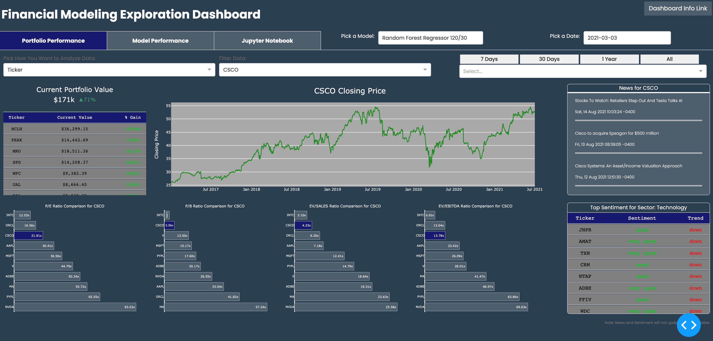

**<h2>SIADS697 Project</h2>**
**<h3>Tyler Drumheller, Jeff Garden, Joseph Kessler</h3>**

<b>Goal:</b> Gathering NYSE historical data and utilizing it to create various portfolio management strategies. Our team employed three different models to test portfolio performance for common strategies.

You can find our blog post describing the work on [Medium](https://medium.com/@tyler.drumheller/predict-or-classify-machine-learning-approaches-to-stock-selection-44740040e830)

* <b>Random Forest Regressor</b>: This method utilizes short to medium term (7 to 120 day) technical analysis to predict prices over those terms using a Random Forest Regressor model. More documentation can be found [here](https://github.com/joeykess/SIADS697/tree/main/assets/models/tyler_rf_daily_update)
* <b>Multi-Factor Multilayer Perceptron (MLP)</b>: This method utilizes Fundamental features as inputs into a binary classification model design to answer one simple question, "Will the future one-year total return on this stock be in the top 50% of all S&P 500 stocks or not?" More documentation can be found [here](https://github.com/joeykess/SIADS697/tree/main/assets/models/jeff_multi_factor)
* <b>CNN Image Pattern Recognition</b>: This method utilizes Convolutional Neural Network to recognize patterns in images to predict how the market will perform within the upcoming few minutes. More documentation can be found [here](https://github.com/joeykess/SIADS697/tree/main/assets/models/joey_cnn_intraday)

<b>Multiple scripts will be utilized to pull raw data:</b>
* Data used by the <b>Random Forest Regressor</b> model is stored in an AWS hosted postgres database. Files used to create the data and store it in the database are as follows: `historical_stocks.py`, `feature_creation.py`, then data is loaded to postgres using `Creating Technical Features Data.ipynb`
* Data used by the <b>Multi-Factor MLP</b> model is stored in an AWS hosted postgres database. Files used to create the data and store it in the database are as follows: `historical_stocks.py`, `feature_creation.py`,`data_collection_five_factor.ipynb`, The functions in `data_collection_five_factor.ipynb`, all require subscriptions to Refinitive Eikon or Datastream Web Services as well as a running Eikon terminal. All ready to use features are stored in a postgres database, executing the `run_feature_engine()` function inside the model notebook will pull raw features from the database and go through all feature engineering and preparation steps but will take up to an hour.  
* Data used by the <b>CNN Image Pattern Recognition</b> model is stored locally and can be grabbed using `short_term_stocks.py` if you have an Alpha Vantage API key. Following the use of `short_term_stocks.py` is the use of `short_chart_creator.py` and then `short_cnn.py` to train the model.

<b>Other Helper Functions:</b>
* Utilize `port_2.py` or `intraday_portfolio.py` classes to trade stocks and track performance, trades, and other metrics. These are python classes built to manage your portfolio as you buy and sell
* Utilize `port_charts.py` to build common financial metric visualizations to understand performance of your portfolio

<H2>Financial Modeling Exploration Dashboard</H2>

<b>Goal</b>
<p>The goal of our Financial Modeling Exploration Dashboard is to allow users to explore stock performance and model predictive power to help make assessments on which stocks they should buy. Our models can be used to build a portfolio autonomously, or used to help users manual select stocks.</p>

<b>Implementation</b>
<p>Our dashboard runs from python scripts using Plotly Dash. It is hosted on AWS as a containerized Docker image, leveraging AWS Elastic Container Service. It follows a similar structure to common Dash dashboard implementations, in that it uses an app.py file to start the dashboard, but "pages" are created separately and loaded together through python import statements. All pages are in our home directory or apps folder, but some data and CSS styling files are stored in the assets folder. The dashboard also makes use of a postgres database to greatly simplify cooridnation between teammates, and allow for future iterations that can update data on a regular cadence.</p>

 <b>This general folder structure is required for all dash apps</b>
``` 
app.py (contains boilerplate server code, as well as CSS reference themes)
index.py (Includes HTML code that structure the top level of the dashboard, including tabs)
apps Folder:
 - __init__.py (Empty required file)
 - portfolio_performance.py (All code required to build the Portfolio Performance tab)
 - model_performance.py (All code required to build the Model Performance tab)
 - jupyter.py (All code required to build the Jupyter Notebook tab)
 - model_stats.py (Not required, but used to display individual HTML Divs for each model)
 - ind_css.py (Used to store custom styling, removes clutter from .py files)
assets Folder:
 - style.css (CSS stylesheet called by the app)
 - Stores individual image, data, and html files
```

<b>The Steps to Load the Dashboard Locally are as Follows:<b>
1. Open the index.py file in a python IDE, such as Atom
2. Run this file in your IDE or from the terminal directly
3. Once running, the dashboard will load to a local server (generally http:0.0.0.0:8050, but http:0.0.0.0:80 for ours (AWS reasons))
4. Your terminal may automatically open the dashboard in your browser, otherwise copy the IP address printed out and paste in browser
5. You can make changes to individual pages directly, and saving will cause the dashboard to hot reload (automatically refresh)
6. Any errors in the python code that cause the dashboard to fail will need to be fixed, and then index.py needs to be re-run

<b>Run this code below to start the app</b>
 ```bash
python -m venv venv
source venv/bin/activate  # Windows: \venv\scripts\activate
pip install -r requirements2.txt
```
then run the app:
```bash
python index.py
```

<H3>Snapshot of Dashboard Portfolio Tab</H3>
 

 
 
 
 
``` 
app.py (contains boilerplate server code, as well as CSS reference themes)
index.py (Includes HTML code that structure the top level of the dashboard, including tabs)
apps Folder:
 - __init__.py (Empty required file)
 - portfolio_performance.py (All code required to build the Portfolio Performance tab)
 - model_performance.py (All code required to build the Model Performance tab)
 - jupyter.py (All code required to build the Jupyter Notebook tab)
 - model_stats.py (Not required, but used to display individual HTML Divs for each model)
 - ind_css.py (Used to store custom styling, removes clutter from .py files)
assets Folder:
 - style.css (CSS stylesheet called by the app)
 - Stores individual image, data, and html files
```
